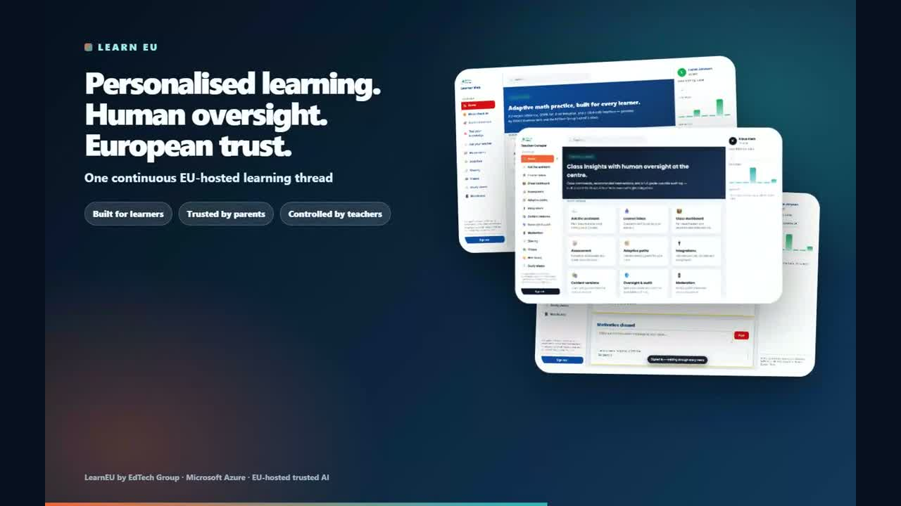

# AMA_Project — LearnEU (Case Study 33)

> Project workspace for the **AI-Driven Personalised Learning Platform for a European EdTech Group** (Case Study 33).
>
> Goal: deliver the case study's **Transformation Objective** while respecting **GDPR Article 8** + **EU AI Act (high-risk)** and meeting all **Expected Outcomes**.

Source brief: [../Subject/case-study-33-edtech-personalised-learning.md](../Subject/case-study-33-edtech-personalised-learning.md)

---
## Marketing video

<video src="https://raw.githubusercontent.com/EtienneSIG/AMA_Project/main/video/LearnEU_Marketing-compressed.mp4" controls></video>

[](https://raw.githubusercontent.com/EtienneSIG/AMA_Project/main/video/LearnEU_Marketing-compressed.mp4)

> ▶ **[Play the marketing video](https://raw.githubusercontent.com/EtienneSIG/AMA_Project/main/video/LearnEU_Marketing-compressed.mp4)**
> · full quality: [LearnEU_Marketing.mp4](https://raw.githubusercontent.com/EtienneSIG/AMA_Project/main/video/LearnEU_Marketing.mp4)

---
## Use case at a glance

**LearnEU** is a privacy-preserving personalised-learning platform for a Dutch EdTech group serving **4.1 M learners** (K-12 + vocational) across **NL, BE, DE, PL, RO**.

**Three AI capabilities** (all EU AI Act **high-risk**, Annex III §3):

| Capability | What it does | Guardrail |
|---|---|---|
| **Adaptive learning** | Adapts content difficulty & pacing to each learner's mastery | On-device / privacy-preserving model — no identifiable data centralised |
| **Curriculum localisation** | Translates & adapts content to national standards (12 mo → 6 weeks) | Human editorial + pedagogical sign-off |
| **Automated assessment** | Grades structured work + gives formative feedback | Teacher-in-the-loop, no autonomous grading |

**Non-negotiable constraints:** EU regions only · consent age 16 (guardian consent under 16) · human oversight on every learner-affecting decision · no facial/emotion recognition · pedagogical sign-off before technical sign-off.

**Azure services (committed by the case study):** Azure OpenAI · Azure Machine Learning · Microsoft Fabric · Power BI · Azure AI Search · Azure Content Safety · Azure API Management · Entra External ID (B2C/CIAM) · Microsoft Purview (gated).

---
## Reproduce this project with Spec Kit

This repository is driven by [GitHub Spec Kit](https://github.com/github/spec-kit).
A fresh contributor can rebuild every artefact (specs, plans, tasks,
implementation) with the same toolchain:

```powershell
# 1) Install uv (https://docs.astral.sh/uv/)
irm https://astral.sh/uv/install.ps1 | iex
$env:Path = "$HOME\.local\bin;$env:Path"

# 2) Install the Specify CLI
uv tool install specify-cli --from git+https://github.com/github/spec-kit.git

# 3) Clone and enter the repo
git clone https://github.com/EtienneSIG/AMA_Project.git
cd AMA_Project

# 4) (one-off, only if .specify/ is missing) re-initialise Spec Kit in place
#    specify init --here --integration copilot --force
```

In VS Code with GitHub Copilot Chat installed, the following slash commands
are available (defined under `.github/prompts/`):

| Command | Purpose |
|---|---|
| `/speckit.constitution` | Amend `.specify/memory/constitution.md` (seven LearnEU principles). |
| `/speckit.specify` | Create a new `specs/<NNN-feature>/spec.md` from a prompt. |
| `/speckit.clarify` | Resolve every `[NEEDS CLARIFICATION]` in the spec. |
| `/speckit.plan` | Produce `specs/<NNN-feature>/plan.md` (AI Act articles, DPIA delta, oversight surface). |
| `/speckit.checklist` | Generate the GDPR / AI Act / RAI checklist. |
| `/speckit.tasks` | Produce `specs/<NNN-feature>/tasks.md`, each task assigned to an accountable agent in `agents/`. |
| `/speckit.analyze` | Cross-check spec / plan / tasks consistency. |
| `/speckit.implement` | Execute the tasks once the Responsible AI Evaluator and Cross-Agent QA Verifier have signed off. |

The mandatory order is: **constitution → specify → clarify → plan →
checklist → tasks → analyze → implement**. Feature branches are created by
`.specify/scripts/powershell/create-new-feature.ps1` and named
`NNN-short-name`.

See [specs/001-learner-tabbed-workspace/spec.md](specs/001-learner-tabbed-workspace/spec.md)
for a worked example back-ported from `demo/feature/learner feature.md`.

---
## What's in this folder

```
AMA_Project/
├── README.md                ← you are here
├── .specify/                ← Spec Kit core (templates, scripts, memory/constitution.md)
├── .github/
│   ├── copilot-instructions.md  ← LearnEU agent guidance & hard constraints
│   └── prompts/             ← installed /speckit.* slash-command prompts
├── Subject/                 ← the source case study + AMA rubric & evaluation
├── specs/                   ← 22 feature specs (NNN-short-name/spec.md, plan.md, tasks.md) + INDEX.md
├── agents/                  ← 11 specialist Copilot chat modes for this case
├── plan/                    ← end-to-end transformation plan (charter → governance)
│   ├── 00-program-charter.md
│   ├── 01-phases-roadmap.md
│   ├── 02-workstreams.md
│   ├── 03-target-architecture.md
│   ├── 04-compliance-eu-ai-act-gdpr.md
│   ├── 05-kpis-outcomes.md
│   ├── 06-risks-register.md
│   ├── 07-governance-rai.md
│   ├── 08-demo-on-azure.md
│   └── 09-step-by-step-tutorial.md
├── demo/                    ← the deployable Azure demo (✅ fully deployed)
│   ├── ARCHITECTURE.md          ← Mermaid architecture of the live rg-learneu-demo
│   ├── azure.yaml               ← azd entrypoint (5 app services)
│   ├── infra/                   ← Bicep (single-subscription deployment)
│   ├── apps/                    ← learner-web / parent-portal / teacher-console / admin / director-portal (+ _shared)
│   ├── ml/                      ← adaptive + assessment models (ONNX client-side)
│   ├── data/                    ← synthetic personas, curricula, glossaries
│   ├── pipelines/               ← localisation, content-safety, continuous-eval
│   ├── scripts/                 ← seed_*, run_demo, acceptance_tests, verify-*
│   ├── DEPLOYMENT-REPORT.md     ← what was deployed + live URLs
│   └── DEPLOYMENT-STATE.md      ← resumable stage checklist
├── restitution/             ← final deck, storyboard, speaker notes, coverage matrix
└── RequirementMatrix/       ← AMA rubric coverage & agentic-handoff evidence
```

---

## Specialist agents

Each agent is a Copilot chat mode tuned for one role. To use them, copy/symlink the files into `.github/chatmodes/` (or use them directly from this folder if your VS Code is configured to auto-discover here).

| # | Agent | Purpose | Use when |
|---|---|---|---|
| 1 | **EdTech Program Orchestrator** | Coordinates all specialists; produces synthesised, executive-ready outputs | Any cross-cutting question or weekly status |
| 2 | **EU AI Act Compliance Officer** | High-risk AI system obligations (Art. 9–15, 43, 72) | Designing/changing any AI feature; preparing CA dossier |
| 3 | **GDPR Children's Data Specialist** | Article 8, DPIA, lawful basis, parental consent | Any new processing of <16 data |
| 4 | **Privacy-Preserving ML Engineer** | Federated, DP, on-device, Confidential Compute | Designing the learner & assessment models |
| 5 | **Learning Sciences Expert** | Pedagogical validity, ZPD, formative assessment, UDL | Reviewing any AI feature touching learners |
| 6 | **Multilingual Content Localisation Lead** | 12mo→6w localisation across NL/BE/DE/PL/RO | Content pipeline design, glossary work |
| 7 | **Responsible AI Evaluator** | Owns the model release gate; fairness/safety/transparency | Every release; quarterly re-evaluation |
| 8 | **Cross-Agent QA & Verifier** | Independent auditor of every other agent's deliverables | After each specialist output; before any phase gate |
| 9 | **Demo Deployment Agent** | Autonomous build-and-deploy of the full demo on your tenant (reads `demo/.env.local`) | When you want to actually run the demo end-to-end |
| 10 | **AMA Rubric Evaluator** | Scores deliverables against the AMA / EMEA rubric | Evidence collection, rubric coverage, restitution prep |
| 11 | **Restitution Deck Builder** | Assembles the final restitution deck & storyboard | Producing the executive readout in [restitution/](restitution/) |
| 12 | **Scale (4 → 1M → 4.1M)** | Scaling the demo architecture to full learner population | Capacity / cost / multi-region planning |

> 💡 The general-purpose chat modes from `AMA/.github/chatmodes/` (Solution Architect, AMA Reviewer, Security & Compliance, FinOps, CxO Challenger, Orchestrator) remain useful for non-EdTech-specific questions.

---

## How to run the program

### Day 1 — Discovery
1. Read [plan/00-program-charter.md](plan/00-program-charter.md) and confirm sponsor + scope
2. Run **`gdpr-children-data-specialist`** on each market → DPIA scope
3. Run **`eu-ai-act-compliance-officer`** on each AI feature → Annex IV file skeleton
4. Run **Azure Data & AI Solution Architect** (from `AMA/`) on [plan/03-target-architecture.md](plan/03-target-architecture.md) → diagrams (Mermaid + draw.io + Excalidraw)

### Each new feature
1. **Program Orchestrator** restates the goal & sequences specialists
2. **Learning Sciences** validates the pedagogical mechanism
3. **Privacy-Preserving ML** designs the data path
4. **GDPR** + **AI Act** validate compliance posture
5. **Localisation** plans market roll-out
6. **Responsible AI Evaluator** signs off the release gate

### Each phase gate
1. Update [plan/04-compliance-eu-ai-act-gdpr.md](plan/04-compliance-eu-ai-act-gdpr.md), [plan/05-kpis-outcomes.md](plan/05-kpis-outcomes.md), [plan/06-risks-register.md](plan/06-risks-register.md)
2. Steering Committee review
3. Decide go / no-go for next phase

---

## Outcome contract (verbatim from the case study)

| Outcome | Target |
|---|---|
| Outcome gap (high vs low schools) | **−26%** |
| Teacher administrative time | **−45%** |
| Localisation cycle | **12 months → 6 weeks** |
| GDPR Article 8 compliance | **100% maintained** |

> Every release decision is measured against this contract.

---

## Feature specifications (22)

The platform roadmap is expressed as **22 Spec Kit features** under [specs/](specs/). Each folder is the single source of truth for its feature (spec + plan + tasks + compliance checklists). See [specs/INDEX.md](specs/INDEX.md) for the full catalog, backlog-coverage map and cross-spec dependencies.

| Role | Specs |
|---|---|
| **Learner (Student)** | 001 Tabbed Workspace · 003 Gamification · 007 Adaptive Learning · 013 Sheet & Item Sharing · 014 Age-Adaptive Theming · 015 AI Tutor Video Links · 016 AI Tutor Voice Mode · 021 Rubric Readiness Gate |
| **Parent** | 006 Parent Portal + Digest |
| **Teacher** | 008 Assessment + Shared Library |
| **Director** | 004 Hierarchy Portal · 005 Reporting Benchmarks · 011 Multi-School Hierarchy · 018 Fabric (Rayfin) App · 022 Fabric App Dashboard (EULearn) |
| **Well-being (cross-role)** | 017 Learner Mood Check-In |
| **Platform / cross-cutting** | 002 Postgres Wake-Up · 009 Interoperability (SCORM/xAPI/SIS) · 010 CMS Versioning · 012 A/B Testing · 019 Three-Column App Shell · 020 UX Editorial Toggle & Left Menu |

All 22 specs are gated against the seven [constitution](.specify/memory/constitution.md) principles (EU-resident · GDPR Art. 8 · AI Act high-risk · teacher-in-the-loop · pedagogical sign-off · outcome-contract · spec-driven).

---

## Deployed demo (Azure)

The [demo/](demo/) folder is **fully deployed** to `rg-learneu-demo` (`westeurope`) via `azd up`. Architecture: [demo/ARCHITECTURE.md](demo/ARCHITECTURE.md) · deployment details: [demo/DEPLOYMENT-REPORT.md](demo/DEPLOYMENT-REPORT.md).

**Live apps** (seed users below):

| App | URL |
|---|---|
| Learner Web | <https://app-learner-web-learneu-demo.azurewebsites.net> |
| Parent Portal | <https://app-parent-portal-learneu-demo.azurewebsites.net> |
| Teacher Console | <https://app-teacher-console-learneu-demo.azurewebsites.net> |
| Admin Console | <https://app-admin-learneu-demo.azurewebsites.net> |

Seed users (password `DemoPass2026!`): `admin@learneu.demo` · `teacher@learneu.demo` · `parent@learneu.demo` · `student@learneu.demo`.

**Runtime shape:** five App Services front an **APIM** (internal VNet) that fronts **Azure OpenAI** (`gpt-5.4-nano`), **Content Safety** and **AI Search**; **PostgreSQL Flexible Server** (private endpoint) is the app data store and mirrors to **Fabric F2** → **Power BI Embedded**; **Azure ML** (HBI) backs the adaptive/assessment models. Public network access is disabled on every backend — only APIM has ingress. Identity is split: workforce tenant for staff, **CIAM `learneu`** for learners/parents.

```powershell
# Redeploy from scratch
cd demo
azd auth login
azd up
```

---

## Conventions
- All personal data processed in **EU regions only**
- Age default for digital consent: **16** (strictest of the 5 markets)
- All AI features for grading/content access treated as **high-risk** by default
- Teacher-in-the-loop is **non-negotiable** — no autonomous decisions affecting learners
- Pedagogical sign-off **before** technical sign-off

---

## Status
- ✅ Specialist agents drafted (12 chat modes in [agents/](agents/))
- ✅ Plan documents drafted (charter → governance) in [plan/](plan/)
- ✅ **22 feature specs** authored, planned and tasked ([specs/INDEX.md](specs/INDEX.md)) — all constitution-gated
- ✅ **Demo fully deployed on Azure** ([demo/DEPLOYMENT-REPORT.md](demo/DEPLOYMENT-REPORT.md)) — 5 apps live, Postgres seeded (6 curricula, 50 synthetic learners), APIM → Azure OpenAI chat path verified, ONNX adaptive model running client-side
- ✅ Architecture documented ([demo/ARCHITECTURE.md](demo/ARCHITECTURE.md)) and restitution deck drafted ([restitution/](restitution/))
- ⏳ DPIAs per market — owner: DPO
- ⏳ AI Act Annex IV conformity dossier — owner: AI Act CO
- ⏳ Production hardening (Premium APIM, PTU, multi-region) beyond demo SKUs

> The plan is intentionally **opinionated** but **revisable**. Update the plan documents after each phase gate.
