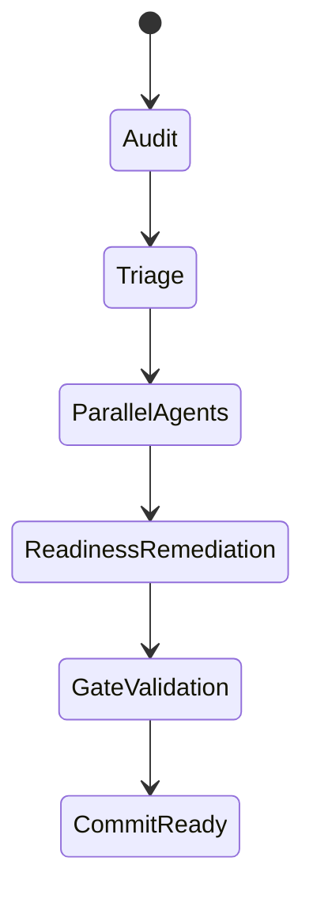

# Agentic Handoff Evidence - 2026-06-29

## Agents Used

| Agent | Mode | Result |
|---|---|---|
| app-code-auditor | Parallel read-only explore agent | Completed; mapped app/source findings to specs and verification scripts. |
| runtime-gate-auditor | Parallel read-only explore agent | Completed; identified missing RequirementMatrix/gate and runtime/lockfile gaps. |

## Handoff State Graph

## Guardrails

- No `git reset --hard`, `git clean`, force-push, Azure resource deletion, secret rotation, or destructive data mutation was performed.
- Browser actions that could mutate data were avoided.
- Deployment was skipped because no deployed behavior change was required.
