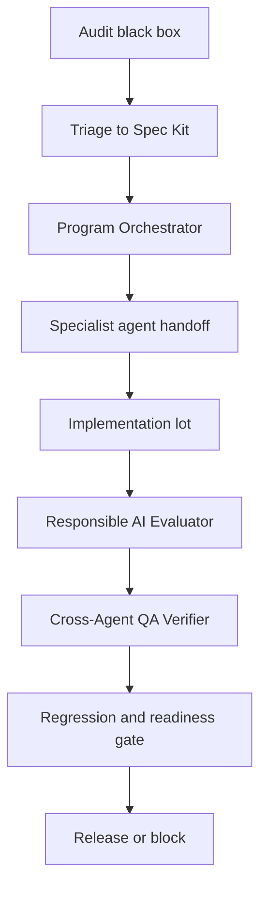

# LearnEU agentic handoff evidence

**Purpose:** close the AMA rubric gap on "Agentic Behavior" by turning the documented Spec Kit agents into an auditable orchestration/state graph.

## State graph



## Handoff matrix

| Step | Agent / role | Input | Output | Evidence path |
|---|---|---|---|---|
| 1 | Audit black-box runner | Specs index, app URLs, demo users, non-destructive constraints. | P0/P1/P2 finding list with console/network/API evidence. | Automation `Audit quotidien LearnEU`; `RequirementMatrix/requirement-analysis-2026-06-29.md`. |
| 2 | EdTech Program Orchestrator | Finding list and case-study outcomes. | Work packages by learner, parent, teacher, admin, director, infra. | `agents/edtech-program-orchestrator.chatmode.md`; specs index. |
| 3 | GDPR Children's Data Specialist | Any change touching minors, consent, parent portal, voice/video, telemetry. | GDPR Art. 8 decision and DPIA delta. | `agents/gdpr-children-data-specialist.chatmode.md`; `plan/04-compliance-eu-ai-act-gdpr.md`. |
| 4 | EU AI Act Compliance Officer | Adaptive, assessment, localisation, or experiment change. | High-risk obligations, Art. 9-15 mapping, PMM impact. | `agents/eu-ai-act-compliance-officer.chatmode.md`; compliance plan. |
| 5 | Privacy-Preserving ML Engineer | Learner model, telemetry, feature store, AI endpoint changes. | Data-minimised model path and no-PII transfer check. | `agents/privacy-preserving-ml-engineer.chatmode.md`; target architecture. |
| 6 | Learning Sciences Expert | Learner activity, teacher feedback, assessment, UX changes. | Pedagogical validity and age-appropriate explanation review. | `agents/learning-sciences-expert.chatmode.md`; feature specs. |
| 7 | Responsible AI Evaluator | Candidate remediation and tests. | Release-gate verdict: fairness/safety/transparency pass or block. | `agents/responsible-ai-evaluator.chatmode.md`; readiness gate output. |
| 8 | Cross-Agent QA Verifier | All specialist outputs and changed specs/code. | Independent consistency review before release. | `agents/cross-agent-qa-verifier.chatmode.md`; `demo/scripts/verify-rubric-readiness.ps1`. |

## Runtime coordination patterns evidenced in code

| Pattern | Implementation | Why it matters for the rubric |
|---|---|---|
| Autonomous recommendation with fallback | `demo/apps/learner-web/server-adaptive.js` generates next-best activity, logs decision, and returns non-adaptive fallback when data is unreliable. | Demonstrates autonomy without unsafe opaque decisions. |
| Human-in-the-loop state transition | Experiment adoption is blocked until teacher/pedagogy sign-off exists in `server-experiments.js`. | Shows orchestration with natural-person checkpoints. |
| Handoff with state token | Director portal mints an HMAC scope context; Fabric app verifies it fail-closed. | Demonstrates secure handoff between apps/services. |
| Reflection / QA gate | Spec Kit workflow requires `analyze` before `implement`; remediation gate re-checks evidence. | Shows agentic reflection before release. |
| Audit trail for orchestration | Adaptive, experiment, admin, and content-safety routes write structured events. | Makes multi-agent and runtime decisions reviewable. |

## Release gate

The release gate for a 60 / 60 submission is:

```powershell
pwsh demo\scripts\verify-rubric-readiness.ps1
```

The gate is intentionally non-destructive. It proves that the agentic workflow is backed by concrete specs, role handoffs, readiness checks, runtime pinning, lockfile reproducibility, and monitoring evidence.
