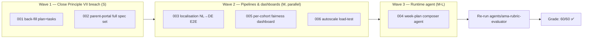

# AMA Rubric Remediation Plan — LearnEU (Spec Kit edition)

> **Target:** Grade A — **57/60 → 60/60** 🎯
> **Date:** 2026-05-22
> **Source evaluation:** `Subject/AMA_Rubric_Evaluation.md` (commit `cbabd87` on `main`)
> **Examiner:** `agents/ama-rubric-evaluator.chatmode.md`
> **Execution model:** Spec Kit — every fix is delivered as a `specs/NNN-…/` feature, advanced through the 7-step workflow defined in `.specify/memory/constitution.md` §"Development Workflow & Quality Gates".

---

## Score gap → Spec Kit features

| Lost pts | Cat. | Gap                                                              | Spec Kit feature folder            |
|----------|------|------------------------------------------------------------------|------------------------------------|
| −1       | #12  | `specs/001-…` is missing `plan.md` / `tasks.md`; **constitutional Principle VII breach** | `specs/001-learner-tabbed-workspace/` *(back-fill — no new feature)* |
| −1       | #12  | `demo/apps/parent-portal/` shipped with **no spec at all**       | `specs/002-parent-portal/` *(new — back-port)* |
| −1       | #5   | Localisation pipeline + Fabric mirroring + federated round not E2E | `specs/003-localisation-nl-de-pipeline/` *(new)* |
| −1       | #9   | No runtime agentic surface in the deployed apps                  | `specs/004-week-plan-composer-agent/` *(new)* |

Defensive (already at 5/5, keep them there):

| Cat. | Risk                                          | Spec Kit feature folder                       |
|------|-----------------------------------------------|------------------------------------------------|
| #7   | No per-cohort fairness dashboard in admin UI  | `specs/005-per-cohort-fairness-dashboard/`     |
| #11  | No load-test report validating autoscale      | `specs/006-autoscale-load-test/`               |

> Each feature is created by:
> `.specify\scripts\powershell\create-new-feature.ps1 -FeatureName <NNN-short-name>`
> which checks out branch `<NNN-short-name>` and scaffolds the spec folder.
> Then you run the 7-step Spec Kit pipeline below per feature.

---

## The Spec Kit pipeline (run for every new feature)

Per `.specify/memory/constitution.md` lines 101–122:

1. `/speckit.specify` — produce `specs/NNN-…/spec.md` from the **brief** below (no tech choices in the spec; P1/P2/P3 user stories; Success Criteria tied to the outcome contract).
2. `/speckit.clarify` — resolve every `[NEEDS CLARIFICATION]` marker. Blocks step 3.
3. `/speckit.plan` — produce `specs/NNN-…/plan.md` listing **EU AI Act articles touched**, **DPIA delta**, **human-oversight surface**.
4. `/speckit.checklist` — run the GDPR / AI Act / RAI checklist; all items green or explicitly waived by the named accountable role.
5. `/speckit.tasks` — produce `specs/NNN-…/tasks.md`; **every task names an accountable agent from `agents/`**.
6. `/speckit.analyze` — confirm spec / plan / tasks alignment.
7. `/speckit.implement` — only after Responsible AI Evaluator **and** Cross-Agent QA Verifier sign off; then deploy per `demo/feature/EXECUTION-PLAN.md` (8-step cycle).

Branch name = feature folder name. Commits are conventional (`feat(...)`, `fix(...)`, `compliance(...)`, `docs(...)`).

---

## Feature briefs (paste straight into `/speckit.specify`)

### `specs/001-learner-tabbed-workspace/` — **back-fill only** (no new spec)

> The spec already exists and is substantive (188 lines). What is missing is `plan.md` and `tasks.md` — the gate that was skipped.

**Action:** check out branch `001-learner-tabbed-workspace` (or a fresh `001-backfill` branch) and run **only** steps 3–6 of the Spec Kit pipeline against the existing `spec.md`:

```
/speckit.plan
/speckit.checklist
/speckit.tasks
/speckit.analyze
```

**Accountable agent for plan content:** EdTech Program Orchestrator with EU AI Act CO + GDPR Children's Data Specialist as co-authors.

**Acceptance:**
- `specs/001-learner-tabbed-workspace/plan.md` lists at minimum AI Act Art. 9, 12, 13, 14, 15 with how each is satisfied.
- `specs/001-learner-tabbed-workspace/tasks.md` exists; every task names an agent from `agents/`.
- `/speckit.analyze` returns no critical contradictions.
- Cross-Agent QA Verifier returns **PASS**.

---

### `specs/002-parent-portal/` — new feature (back-port from `demo/apps/parent-portal/`)

**`/speckit.specify` brief:**

> Provide a **Parent Portal** as a dedicated web app for the parent persona (Sophie, NL — see `demo/DEMO-STORYTELLING.md:9-17`). The parent must be able to (P1) sign in with a parent-scoped account, (P2) view their own child's curriculum unit and consent status, (P3) grant or withdraw consent for AI-assisted personalisation for an under-16 learner. The portal must respect the age-16 default and the GDPR Art. 8 guardian-consent flow. It must reuse the canonical `_shared/` middleware (auth, CSRF, rate-limit, Content Safety) and live in EU regions only. Success criteria: 100 % of consent state-changes are logged for AI Act Art. 12 evidence; no learner PII appears in any AI prompt; the parent can revoke consent and see the child's personalisation revert to the non-AI baseline within one session.

**`/speckit.plan` must call out:**
- EU AI Act articles touched (esp. Art. 13 transparency, Art. 14 oversight via teacher escalation path).
- DPIA delta: parent identity, guardian-child relationship, consent ledger.
- Human-oversight surface: teacher console receives a notification on consent withdrawal.

**Accountable agents in tasks.md:**
- GDPR Children's Data Specialist (lawful basis + parental consent flow).
- EdTech Program Orchestrator (handoff orchestration).
- Privacy-Preserving ML Engineer (verify no PII in prompts).
- Cross-Agent QA Verifier (sign-off).

**Acceptance:**
- Full `specs/002-parent-portal/{spec.md, plan.md, checklist.md, tasks.md}` committed before any further change to `demo/apps/parent-portal/`.
- `/speckit.analyze` clean.
- The existing parent-portal code passes the checklist as-is, or a remediation PR is opened.

---

### `specs/003-localisation-nl-de-pipeline/` — new feature

**`/speckit.specify` brief:**

> Deliver an **end-to-end NL→DE localisation pipeline** for one curriculum unit (start with `demo/data/math_unit_fractions.md`). The pipeline must (P1) ingest the source unit, (P2) translate via Azure OpenAI with the LearnEU glossary, (P3) route through a human reviewer queue in the Teacher Console, (P4) publish the validated DE version into `demo/apps/learner-web/data/curricula/de-bildungsstandards-math-y7.json` with provenance metadata (source unit ID, translator model, reviewer ID, timestamp). The pipeline must never send learner PII into prompts (curriculum content only). Success criteria tied to the outcome contract: **a complete unit reaches the DE shelf in ≤ 6 weeks elapsed (proxy: ≤ 6 minutes of pipeline time for the demo)**; reviewer overhead ≤ 30 minutes per unit; zero glossary-term violations in the published artefact.

**`/speckit.plan` must call out:**
- EU AI Act articles touched (Art. 10 data governance for translation corpus, Art. 13 transparency to teachers, Art. 14 reviewer oversight).
- DPIA delta: none (no personal data).
- Human-oversight surface: Teacher Console review queue + reject/accept telemetry.

**Accountable agents in tasks.md:**
- Content Localisation Lead (pipeline + glossary).
- Privacy-Preserving ML Engineer (PII-isolation contract).
- Demo Deployment Agent (wire `demo/pipelines/localisation/localise.py` into the deployed slot).
- Responsible AI Evaluator (translation-quality gate).

**Acceptance:**
- `demo/pipelines/localisation/RUN-<date>.md` records one full run.
- `demo/DEPLOYMENT-REPORT.md` localisation row moves **PARTIAL → PASS**.
- `restitution/slides/slide-14-market-localisation.md` references the run.

---

### `specs/004-week-plan-composer-agent/` — new feature

**`/speckit.specify` brief:**

> Add a **runtime agent loop** to `demo/apps/learner-web/` called the *Week-Plan Composer*. Given a learner's current mastery state, it (P1) drafts a 5-day study plan by chaining: AI Search (retrieve next ZPD-appropriate items from curriculum) → Azure OpenAI (compose pedagogical narrative) → Content Safety (scan output). The proposed plan (P2) is **never auto-published**: it is routed to the teacher's review queue with a clear diff against the previous plan. The teacher must (P3) accept, edit, or reject — every action logged for AI Act Art. 12. On accept, the plan publishes to the learner's tabbed workspace. Success criteria: every published plan has a teacher approval timestamp; override/edit rate is measured and reported per-cohort; zero plans published without Content Safety verdict = "accept".

**`/speckit.plan` must call out:**
- EU AI Act articles touched (Art. 9 risk mgmt, Art. 14 oversight — this is the new high-risk runtime surface).
- DPIA delta: tool-orchestration metadata (which tools were called, with what inputs).
- Human-oversight surface: teacher review queue is the gate; no autonomous publication.

**Accountable agents in tasks.md:**
- EdTech Program Orchestrator (agent loop design).
- Learning Sciences Expert (pedagogical rationale + ZPD targeting at P=0.7).
- Privacy-Preserving ML Engineer (no raw learner PII in AOAI prompts; on-device state where possible).
- Responsible AI Evaluator (release gate: override rate ≤ 10 %, safety violations ≤ 0.1 %, per-cohort acceptance disparity ≤ 5 pp).
- Cross-Agent QA Verifier (final sign-off).

**Acceptance:**
- `learner-web` exposes a `/api/week-plan/propose` route that requires a `teacher-approved=true` flag before persistence.
- Telemetry captured in `ask_history` / new `week_plan_decisions` table.
- Restitution slide added (#9 Autonomy talking points).

---

### `specs/005-per-cohort-fairness-dashboard/` — defensive (keeps #7 at 5/5)

**`/speckit.specify` brief:**

> Extend `demo/apps/admin/` with a **per-cohort fairness dashboard** that reads from `ask_history` and `content_safety_results`, broken down by **Country / Language / SEN status / Gender**. The dashboard must (P1) show acceptance rate, Content Safety violation rate, and override rate per cohort; (P2) compute the disparity (max − min) and red-flag any disparity > 5 pp against the Responsible AI Evaluator release gate; (P3) export a CSV for the EU AI Act Annex IV technical file. Success criteria: cohorts visible in seed data; release gate thresholds enforced in the UI; the same KQL workbook reproducible from `demo/observability/`.

**Accountable agents in tasks.md:**
- Responsible AI Evaluator (cohort definitions + thresholds).
- Demo Deployment Agent (KQL workbook artefact under `demo/observability/`).

**Acceptance:**
- Admin UI page live; section #7 of the next `AMA_Rubric_Evaluation.md` cites it as new evidence.

---

### `specs/006-autoscale-load-test/` — defensive (keeps #11 at 5/5)

**`/speckit.specify` brief:**

> Validate the App Service autoscale rules (`demo/infra/modules/app-service.bicep:61-135`) with a **reproducible load test** against `learner-web`. The test must (P1) drive sustained CPU > 70 % for ≥ 10 minutes and verify a scale-out 1 → 2 instances is observed in App Insights; (P2) capture latency p50/p95/p99 and throughput; (P3) publish a report under `demo/perf/LOAD-TEST-REPORT-<date>.md` with the methodology, raw results, autoscale events, and verdict.

**Accountable agents in tasks.md:**
- Demo Deployment Agent (script + run).
- Cross-Agent QA Verifier (verdict review).

**Acceptance:**
- `demo/scripts/load-test.ps1` committed; one report under `demo/perf/`; section #11 of the next `AMA_Rubric_Evaluation.md` cites it.

---

## Sequencing (waves you can parallelise across owners)



Wave 1 is mechanical — back-filling specs unlocks the Presentation point and clears the constitutional flag. Wave 2 fixes the Implementation point and defends two existing 5/5 scores in parallel. Wave 3 brings runtime autonomy. Then re-grade.

---

## After all features implement: re-grade

Run the AMA Rubric Evaluator chatmode against the new `HEAD`:

```
/agents/ama-rubric-evaluator make the evaluation
```

It will:
- Re-parse `Subject/AMA_Rubric_EMEA.docx`.
- Walk every category for new evidence.
- Apply all deduction triggers (Principle VII should now clear).
- Overwrite `Subject/AMA_Rubric_Evaluation.md`; archive the previous as `Subject/AMA_Rubric_Evaluation.<date>.md`.
- Update this file's status table below.

---

## Status tracker (update as features land)

| # | Spec Kit feature                              | Branch                                | Spec | Plan | Tasks | Analyze | Implement | Merged to main |
|---|-----------------------------------------------|---------------------------------------|------|------|-------|---------|-----------|----------------|
| 1 | `001-learner-tabbed-workspace` (back-fill)    | `001-learner-tabbed-workspace`        | ✅   | ⏳   | ⏳    | ⏳      | n/a       | ⏳             |
| 2 | `002-parent-portal`                            | `002-parent-portal`                   | ⏳   | ⏳   | ⏳    | ⏳      | ⏳        | ⏳             |
| 3 | `003-localisation-nl-de-pipeline`              | `003-localisation-nl-de-pipeline`     | ⏳   | ⏳   | ⏳    | ⏳      | ⏳        | ⏳             |
| 4 | `004-week-plan-composer-agent`                 | `004-week-plan-composer-agent`        | ⏳   | ⏳   | ⏳    | ⏳      | ⏳        | ⏳             |
| 5 | `005-per-cohort-fairness-dashboard`            | `005-per-cohort-fairness-dashboard`   | ⏳   | ⏳   | ⏳    | ⏳      | ⏳        | ⏳             |
| 6 | `006-autoscale-load-test`                      | `006-autoscale-load-test`             | ⏳   | ⏳   | ⏳    | ⏳      | ⏳        | ⏳             |

---

## Definition of done (60/60)

- [ ] All six feature folders exist with **spec.md + plan.md + tasks.md** committed.
- [ ] `/speckit.analyze` returns clean for every feature.
- [ ] Cross-Agent QA Verifier returns **PASS** on every feature.
- [ ] Re-run of `agents/ama-rubric-evaluator` produces **60/60 — Grade A** in `Subject/AMA_Rubric_Evaluation.md`.
- [ ] Constitution flag for Principle VII clears (all seven principles ✅).
- [ ] This file is renamed to `Subject/ama-rubric-remediation-plan.completed-<date>.md`.
