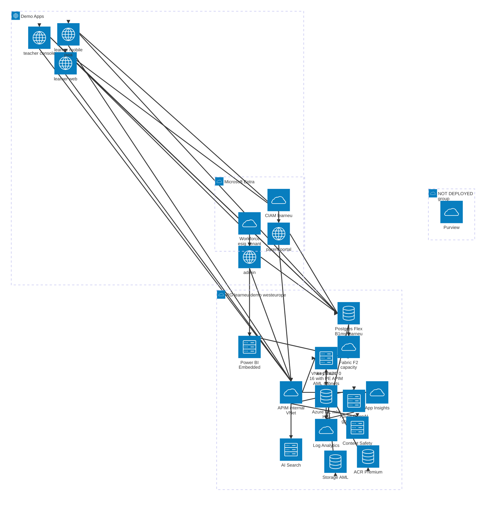
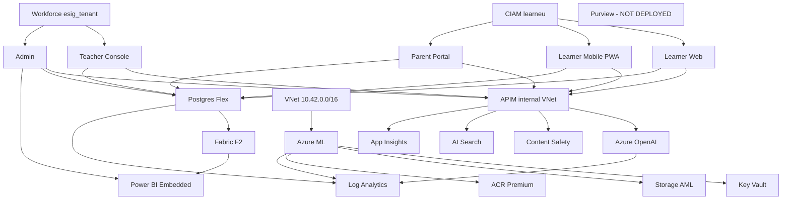

# LearnEU — Target Architecture (Mermaid)

Visual representation of the deployed `rg-learneu-demo` resource group plus the surrounding identity and external systems. Generated from `infra/main.bicep` after Stage 2 fixes (Purview & Fabric gated off; APIM NSG attached; AML wired to Application Insights).

> Uses Mermaid's [`architecture-beta`](https://mermaid.js.org/syntax/architecture.html) diagram type (Mermaid ≥ 10.9). Built-in icons (`cloud`/`database`/`disk`/`internet`/`server`); swap for `logos:azure-*` after registering an Iconify pack. Note: `architecture-beta` does not support `classDef`, dashed nodes, or nested subgraphs — gated/not-deployed items are rendered as a separate group with `[NOT DEPLOYED]` in the label.



## Notes
- **Viewer compatibility:** some Mermaid renderers do not support `architecture-beta`. If the first diagram does not render, use the fallback `flowchart` diagram below.
- **Gated off (dashed):** Purview is **not** provisioned in this run. Documented as follow-up in `DEPLOYMENT-REPORT.md`. Fabric F2 capacity and Power BI Embedded are deployed and connected to director-portal for reporting.
- **Public network access:** disabled on Key Vault, OpenAI, Content Safety, AI Search, AML, Storage, ACR. Only APIM has public ingress, fronting all backends.
- **EU residency:** all resources in `westeurope`. EU-only allowlist enforced in `infra/main.bicep`.
- **Identity split:** workforce tenant for staff (Teacher), CIAM tenant `learneu` for end users (Learner, Parent), per Case Study 33 §4.3.
- **Learner mobile surface:** `learner mobile pwa` is a logical UX surface (`/mobile.html`) served by the same `learner-web` App Service, not a separate Azure resource.
- **Fabric + Power BI:** Postgres mirrors data to Fabric F2 capacity for analytical reporting. Director portal embeds Power BI visuals via managed embedding.
- **Model:** OpenAI `gpt-5.4-nano` version `2026-03-17` (reasoning, 400K context window), GlobalStandard, 50K TPM (Plan B — no PTU available in West Europe at deployment time). Confirmed available in West Europe per Microsoft Learn region table (April 2026).
- **App data store:** Azure Database for PostgreSQL Flexible Server (`pg-learneu-demo`), Burstable B1ms, PostgreSQL 16, 32 GB, public access disabled, private endpoint in `snet-pe`, TLS required. Three tables: `connection_logs`, `ask_history`, `sheets`. Admin password generated at deploy time and stored in Key Vault as `pg-admin-password` — every App Service consumes it via `@Microsoft.KeyVault` reference. Auto-applied schema lives in `apps/_shared/db/schema.sql`.

## Fallback Diagram (flowchart)



## How to render
- VS Code with the Mermaid preview extension, or
- `mmdc -i ARCHITECTURE.md -o ARCHITECTURE.svg`, or
- Push to GitHub — Mermaid is rendered natively in fenced ```mermaid blocks.
