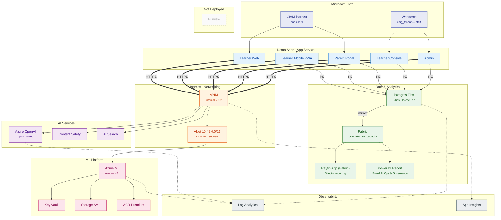

# LearnEU — Target Architecture (Mermaid)

Visual representation of the deployed `rg-learneu-demo` resource group plus the surrounding identity and external systems. Generated from `infra/main.bicep` after Stage 2 fixes (Purview & Fabric gated off; APIM NSG attached; AML wired to Application Insights).

> Rendered as a layered `flowchart` (Mermaid ≥ 8.x, natively supported by GitHub, VS Code preview and `mmdc`). Nodes are grouped by tier and colour-coded to keep the data flow easy to follow. Gated / not-deployed items use a dashed grey style.

## Notes

- **Legend:** solid bold arrows = user HTTPS traffic; solid thin arrows = service-to-service calls / private-endpoint data access; dotted arrows = telemetry and networking associations. Each tier is colour-coded (identity, apps, gateway, AI, data, ML, observability).
- **Gated off (dashed grey):** Purview is **not** provisioned in this run. Documented as follow-up in `DEPLOYMENT-REPORT.md`. The **Fabric** capacity hosts the **Rayfin app** (director reporting) and the **board Power BI report**, connected to the director / board reporting surfaces.
- **Public network access:** disabled on Key Vault, OpenAI, Content Safety, AI Search, AML, Storage, ACR. Only APIM has public ingress, fronting all backends.
- **EU residency:** all resources in `westeurope`. EU-only allowlist enforced in `infra/main.bicep`.
- **Identity split:** workforce tenant for staff (Teacher), CIAM tenant `learneu` for end users (Learner, Parent), per Case Study 33 §4.3.
- **Learner mobile surface:** `learner mobile pwa` is a logical UX surface (`/mobile.html`) served by the same `learner-web` App Service, not a separate Azure resource.
- **Fabric reporting:** Postgres mirrors to the **Fabric** capacity (OneLake). **Director** analytics run as a native **Rayfin Fabric app** surfaced in the director portal; the **board** consumes a dedicated **Power BI report** (Board FinOps & Governance) built on the same Fabric data. Power BI Embedded has been **retired** (spec 018/022).
- **Model:** OpenAI `gpt-5.4-nano` version `2026-03-17` (reasoning, 400K context window), GlobalStandard, 50K TPM (Plan B — no PTU available in West Europe at deployment time). Confirmed available in West Europe per Microsoft Learn region table (April 2026).
- **App data store:** Azure Database for PostgreSQL Flexible Server (`pg-learneu-demo`), Burstable B1ms, PostgreSQL 16, 32 GB, public access disabled, private endpoint in `snet-pe`, TLS required. Three tables: `connection_logs`, `ask_history`, `sheets`. Admin password generated at deploy time and stored in Key Vault as `pg-admin-password` — every App Service consumes it via `@Microsoft.KeyVault` reference. Auto-applied schema lives in `apps/_shared/db/schema.sql`.

## How to render

- VS Code with the Mermaid preview extension, or
- `mmdc -i ARCHITECTURE.md -o ARCHITECTURE.svg`, or
- Push to GitHub — Mermaid is rendered natively in fenced \`\`\`mermaid blocks.
