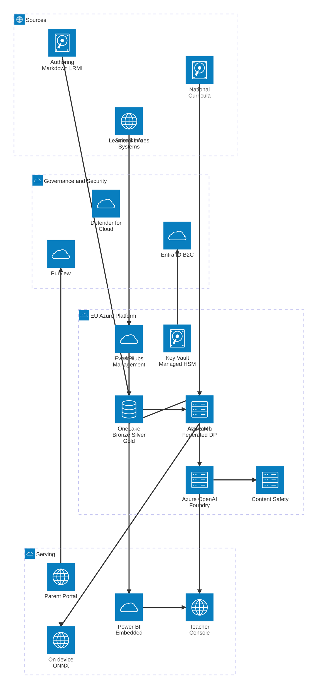

# 03 — Target Architecture

> 💡 Run the **`Azure Data & AI Solution Architect`** chat mode (in `AMA/.github/chatmodes/`) on this plan to regenerate the full Mermaid / draw.io / Excalidraw diagrams with official icons.

## Layered view

### 1. Sources
- School Information Systems (SIS) — pseudonymised feeds only
- Teacher-authored content (canonical Markdown + LRMI metadata)
- National curriculum frameworks (NL/BE/DE/PL/RO)
- Learner devices (browser / mobile app) — local interaction signals

### 2. Ingestion
- **Azure API Management** — single entry point for SIS + partner APIs; rate-limit, OAuth 2.0, AAD B2C JWT validation, OWASP policies
- **Azure Event Grid + Event Hubs** — learner interaction telemetry (pseudonymised, aggregated client-side where possible)
- **Azure Data Factory** — batch SIS extracts (where federated push isn't possible)

### 3. Storage
- **Microsoft Fabric — OneLake** as the single logical lake
  - **Bronze** — raw pseudonymised events (short retention)
  - **Silver** — modelled, deduplicated, conformed
  - **Gold** — analytics marts, no learner-level data
- **Azure ML Feature Store** — features only, no PII, with row-level lineage in Purview
- **Azure Blob Storage (immutable, EU)** — audit logs (AI Act Art. 12), retention policies enforced
- **Azure Key Vault Managed HSM** — pseudonymisation keys, customer-managed keys for all storage

### 4. Processing
- **Microsoft Fabric Notebooks / Spark** — content analytics, curriculum mapping, evaluation pipelines
- **Azure Machine Learning** — adaptive learner model training (federated runtime), assessment AI training, model registry
- **Azure AI Foundry / Azure OpenAI** — localisation generation, formative feedback generation
- **Azure AI Search** — vector index of curricula + content for retrieval-augmented localisation
- **Azure AI Content Safety** — gate on all generative outputs

### 5. Serving / Consumption
- **Edge / on-device** — ONNX Runtime in browser & mobile app for the learner model (default path)
- **Azure ML Online Endpoints** (no payload retention) — fallback inference and assessment
- **Power BI (embedded in Fabric)** — teacher dashboards, school dashboards, ministry-grade aggregate reports
- **Teacher Console** (web app on Azure App Service / Container Apps) — overrides, explanations, intervention flows
- **Parent Portal** — consent, transparency, rights requests

### 6. Governance & Security (cross-cutting)
- **Microsoft Entra ID** for staff; **Azure AD B2C** per country for parents/learners (with national eID where available)
- **Microsoft Purview** — catalog, sensitivity labels (incl. *Child Personal Data — Restricted*), DLP, data lineage
- **Microsoft Defender for Cloud** + **Defender for Endpoint / Cloud Apps** — security posture, threat detection
- **Azure Policy + Blueprints** — region pinning, customer-managed-key enforcement, no-PII-to-PaaS policies
- **Confidential Computing** — Azure Confidential VMs / AKS for any centralised training that handles re-identifiable signals
- **Logging** — Azure Monitor + immutable Storage; KQL workbooks for AI Act Art. 12 compliance

---

## Region strategy (EU-only)

| Country tenant | Primary region | DR region |
|---|---|---|
| NL, BE-NL, BE-FR | West Europe | North Europe |
| DE | Germany West Central | West Europe |
| PL | Poland Central | West Europe |
| RO | West Europe | North Europe |

All Azure OpenAI / Foundry deployments use the **EU Data Boundary**; verify per-service Microsoft sub-processor disclosures before go-live.

---

## Network & isolation
- VNet per environment, **Private Endpoints** for all PaaS
- No public exposure except APIM (front door) and parent/teacher web apps (behind Front Door + WAF)
- Egress controlled via Azure Firewall + DNS Private Resolver
- Per-country logical isolation via Azure ML workspaces + Fabric workspaces tagged per market

---

## Key data flows (high level)

1. **Personalisation loop (default = on-device)**  
   Learner interaction → on-device inference (ONNX) → next content unit. Periodic federated round: device sends DP-protected gradients → secure aggregation → updated model published to registry → re-deployed to devices.

2. **Assessment grading**  
   Learner submission → APIM → Assessment AI online endpoint (no payload retention) → rubric output + confidence → teacher console for review/override → grade persisted (school controller).

3. **Localisation pipeline**  
   Author commits canonical unit → AI Search retrieves curriculum mapping → Azure OpenAI generates localised draft per market with glossary → Content Safety gate → reviewer console → publish to OneLake content catalog.

4. **Teacher dashboard**  
   Aggregated, no individual-level child PII → Power BI embedded in Fabric → teacher view. Drill-down to individual learner only when teacher is the legitimate controller for that learner.

---

## Alternatives considered (briefly)

- **Synapse instead of Fabric** — rejected: Fabric's OneLake unifies the lake + warehouse + RTI story and aligns better with Power BI embedding for teachers; Synapse would add stitching overhead.
- **Databricks for ML instead of Azure ML** — viable, but Azure ML's Responsible AI dashboard, model registry, and online endpoints with no-payload-retention are faster paths to AI Act compliance evidence. Reconsider for Phase 5 if heavy Spark workloads dominate.
- **Centralised training instead of federated** — rejected for the learner model (incompatible with the case-study constraint of *not storing identifiable child data*); kept as a fallback for assessment models trained on consented teacher-rated samples only.

---

## Diagram skeleton (Mermaid — `architecture-beta`)

> Uses Mermaid's [`architecture`](https://mermaid.js.org/syntax/architecture.html) diagram type (Mermaid ≥ 10.9). Icons use the built-in set (`cloud`, `database`, `disk`, `internet`, `server`); swap for `logos:azure-*` once an Iconify pack is registered.

