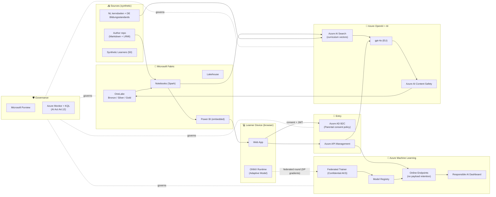

# 08 — Demo on Azure (Case Study 33 stack)

End-to-end **deployable demo** showcasing the three AI capabilities — adaptive learning, curriculum localisation, automated assessment — using **only the Azure services committed in the case study**:

> Azure Machine Learning · Microsoft Fabric · Azure Content Safety · Power BI · Azure OpenAI · Microsoft Purview · Azure API Management · Azure AD B2C

The demo is intentionally **scope-bounded** — one subject (Math), one grade (Year 7), two markets (NL + DE), synthetic data only — so it can be reproduced in a single Azure subscription within a sprint.

---

## Demo storyline (15 minutes)

| Min | Persona | Action | Azure service highlighted |
|---|---|---|---|
| 0–2 | Parent | Logs into Parent Portal via national eID → grants consent for child (15) | **Azure AD B2C** + custom policy |
| 2–5 | Author | Commits a Math unit (Markdown) → Localisation pipeline auto-translates NL→DE with glossary + Content Safety gate | **Azure OpenAI** + **Azure AI Search** + **Azure Content Safety** |
| 5–8 | Learner (NL) | Opens lesson in browser → on-device adaptive model picks next exercise → submits answer | **Azure ML** federated model + ONNX edge inference |
| 8–11 | Assessment AI | Grades short-answer + provides formative feedback | **Azure ML Online Endpoint** + **Azure OpenAI** + **Content Safety** |
| 11–13 | Teacher | Reviews dashboard, overrides one grade, sees explainability | **Power BI in Fabric** + Teacher Console |
| 13–15 | DPO | Opens compliance view: lineage, sensitivity labels, AI Act audit log | **Microsoft Purview** + Azure Monitor |

---

## Demo scope (intentionally narrow)

| Dimension | Demo scope |
|---|---|
| Subject | Math — fractions |
| Grade | Year 7 (≈ 12 y/o) |
| Markets | NL (canonical) + DE (localised) |
| Learners | 50 synthetic personas (no real children) |
| Schools | 2 synthetic schools per market |
| Languages | nl-NL, de-DE |
| Duration in Azure | 1 subscription, 1 region (West Europe) for demo (production multi-region) |

---

## Technology mapping (case study services → demo features)

| Case study service | Demo usage |
|---|---|
| **Azure AD B2C** | Parent + learner sign-in; mocked national eID via SAML test IdP; custom policies for parental consent |
| **Azure API Management** | Single front door for all APIs; OAuth 2.0 JWT validation; rate-limit; OWASP policies; products per audience (Parent, Teacher, Backend) |
| **Microsoft Fabric (OneLake + Lakehouse + Notebooks + Power BI)** | Bronze/Silver/Gold zones; pseudonymised events; teacher dashboards via embedded Power BI |
| **Azure Machine Learning** | Adaptive learner model (federated + DP-SGD prototype); Assessment AI (rubric grader fine-tuned small model); Responsible AI dashboard; online endpoints with no payload retention |
| **Azure OpenAI** | Localisation generation (gpt-4o in EU Data Boundary); formative feedback generation for assessment AI; deployed as PTU for predictable demo cost |
| **Azure AI Search** | Vector index of NL kerndoelen + DE Bildungsstandards; retrieval for localisation prompts |
| **Azure AI Content Safety** | Gate on every generated output (text + image); jailbreak shield; protected material detection |
| **Microsoft Purview** | Catalog of OneLake assets; sensitivity label *Child Personal Data — Restricted*; lineage from source → model |
| **Power BI** | Teacher dashboard, school-level mastery view, fairness disparity view (no individual learner PII) |

---

## Reference architecture (demo)



---

## Demo repository layout (proposed)

```
demo/
├── infra/                     # Bicep — single deployment for the demo
│   ├── main.bicep
│   ├── modules/
│   │   ├── b2c.bicep
│   │   ├── apim.bicep
│   │   ├── fabric-capacity.bicep
│   │   ├── aml-workspace.bicep
│   │   ├── openai.bicep         # incl. PTU + content filter
│   │   ├── ai-search.bicep
│   │   ├── content-safety.bicep
│   │   ├── purview.bicep
│   │   ├── keyvault-hsm.bicep
│   │   ├── monitor.bicep
│   │   └── networking.bicep     # VNet + Private Endpoints
│   └── azure.yaml               # azd up entrypoint
├── data/
│   ├── synthetic_learners.csv   # 50 personas (no real children)
│   ├── math_unit_fractions.md   # canonical authoring sample
│   ├── glossaries/
│   │   ├── math-nl-NL.csv
│   │   └── math-de-DE.csv
│   └── curricula/
│       ├── nl-kerndoelen-math-y7.json
│       └── de-bildungsstandards-math-y7.json
├── ml/
│   ├── adaptive_model/          # PyTorch + DP-SGD + ONNX export
│   │   ├── train_central.py     # demo path on synthetic data
│   │   ├── federated_round.py   # Flower-based round (Confidential AKS)
│   │   └── export_onnx.py
│   └── assessment_model/        # rubric grader (small model + LLM-judge fallback)
│       ├── train.py
│       └── score_endpoint.py
├── apps/
│   ├── learner-web/             # React + ONNX Runtime Web
│   ├── teacher-console/         # React + Power BI Embed
│   └── parent-portal/           # B2C custom UI
├── pipelines/
│   ├── localisation/            # Prompt flow / AML pipeline
│   ├── content-safety/
│   └── continuous-eval/         # RAI continuous evaluation
└── scripts/
    ├── seed_curricula.ps1
    ├── seed_learners.ps1
    └── run_demo.ps1
```

---

## Step-by-step walk-through

### Pre-req — provision the demo environment
```powershell
# from demo/
azd auth login
azd env new learneu-demo
azd up        # deploys Bicep, configures B2C tenant, provisions Fabric capacity, etc.
.\scripts\seed_curricula.ps1
.\scripts\seed_learners.ps1
```

### Step 1 — Parental consent (Azure AD B2C)
- Custom B2C policy `B2C_1A_PARENTAL_CONSENT` collects parental ID, child ID, and grants consent for specific processing purposes
- Consent receipt persisted to OneLake Silver with sensitivity label *Child Personal Data — Restricted* applied via Purview
- **Demo highlight:** show the consent receipt + Purview lineage from receipt → consent table → downstream use

### Step 2 — Localisation pipeline (Azure OpenAI + AI Search + Content Safety)
- Author commits `math_unit_fractions.md`
- Pipeline (Azure ML or Fabric Data Pipeline):
  1. Embed unit + retrieve mappings from AI Search (per market)
  2. Call Azure OpenAI with country-specific prompt pack + glossary
  3. Run Azure AI Content Safety (text + jailbreak shield)
  4. Persist localised output to OneLake `content/de-DE/...` with version + reviewer placeholder
- **Demo highlight:** show 1 unit localised NL→DE in < 2 minutes; show Content Safety verdict in the artifact

### Step 3 — Adaptive personalisation (Azure ML federated + ONNX edge)
- The learner web app loads ONNX model in the browser; chooses next item locally
- Once per demo run, kick off a **federated round**:
  - Devices send DP-protected gradients to a Confidential AKS aggregator
  - Aggregator publishes new model version to AML Registry
  - Updated ONNX redeployed to clients
- **Demo highlight:** open browser DevTools to show that the personalisation decision is made client-side; show the AML model registry with model card + DP ε budget metric

### Step 4 — Automated assessment (Azure ML Online Endpoint + Azure OpenAI + Content Safety)
- Learner submits a short answer
- APIM routes to AML Online Endpoint (no payload retention) for rubric grading + confidence
- If confidence < 0.85 → fallback to Azure OpenAI judge prompt with rubric (also gated by Content Safety)
- Result returned with structured rationale
- **Demo highlight:** override flow in Teacher Console; show the override telemetry feeding the RAI dashboard

### Step 5 — Teacher dashboard (Power BI in Fabric)
- Embedded Power BI report shows:
  - Class mastery heatmap
  - Per-cohort fairness disparity (gating metric)
  - Override rate trend
- **Demo highlight:** drill from class view to a specific exercise; show that no individual learner PII is exposed by default

### Step 6 — Compliance view (Microsoft Purview + Azure Monitor)
- Open Purview: lineage from learner event → silver table → feature → model → endpoint → dashboard
- Open Azure Monitor workbook: AI Act Art. 12 audit log (input hash, output, model version, override decision)
- **Demo highlight:** answer a mock erasure request — show the cascading deletion across OneLake, Feature Store, and (hashed-only references retained) audit logs

---

## Demo cost guardrails

| Service | Demo SKU / config | Why |
|---|---|---|
| Azure OpenAI | gpt-4o, **PTU 50** during demo, PAYG when idle | Predictable latency on stage |
| Azure AI Search | Standard S1, 1 partition | Vectors fit easily |
| Azure ML | CPU compute cluster (Standard_D4s_v5 × 2) + 1× NCas-T4 v3 for federated training spike | Cheap; GPU only on demand |
| Fabric capacity | F2 (smallest) for demo; pause when idle | Lowest viable for OneLake + Power BI |
| APIM | Developer tier (demo only) | Production = Premium with VNet |
| Azure AD B2C | Free tier (≤ 50K MAU) | Demo well within free tier |
| Content Safety | Standard, capped per minute | Caps + idle pauses |
| Purview | Pay-as-you-go for demo catalog | Small footprint |

> ⚠️ The demo deliberately uses Developer/Standard SKUs. Production targets (Premium APIM, multi-region failover, dedicated Fabric capacity) live in the architecture doc, not in the demo Bicep.

---

## Acceptance criteria for the demo

- [ ] `azd up` deploys all components in < 60 minutes from a clean subscription
- [ ] Parent consent flow works with mocked eID
- [ ] One Math unit localises NL→DE end-to-end with Content Safety verdict visible
- [ ] Learner web app makes ≥ 1 personalisation decision **fully client-side** (verifiable in DevTools)
- [ ] Federated round publishes a new model version to AML Registry with model card
- [ ] Teacher Console grades 1 short-answer assignment, allows override, shows rationale
- [ ] Power BI dashboard shows fairness disparity per cohort
- [ ] Purview shows complete lineage; Azure Monitor shows AI Act Art. 12 log
- [ ] Mock erasure request executes cascade in < 5 minutes

---

## What's NOT in the demo (and why)
- Multi-region failover — production concern; covered in [03-target-architecture.md](03-target-architecture.md)
- Real children's data — never; only synthetic personas
- All 5 markets — demo limited to NL + DE
- Notified-body conformity assessment artefacts — placeholder PDFs only; full dossier is a Phase 3 deliverable

---

## Demo build plan (sprint-sized)

| Day | Deliverable | Owner |
|---|---|---|
| 1 | Bicep skeleton + `azd up` provisioning all SKUs | Platform |
| 2 | B2C tenant + parental consent policy | Identity |
| 3 | Synthetic data + curricula + glossaries | Data |
| 4 | Localisation pipeline (Azure OpenAI + AI Search + Content Safety) | ML |
| 5 | Adaptive model train + ONNX export + browser integration | ML |
| 6 | Federated round on Confidential AKS | ML |
| 7 | Assessment endpoint + APIM wiring | ML + API |
| 8 | Teacher Console + Power BI embedding | App |
| 9 | Parent Portal + erasure cascade | App |
| 10 | Purview catalog + Azure Monitor workbook + dry run | Compliance + SRE |

---

## Next step

Generate the actual `infra/` Bicep + scripts. Switch to the **`Azure Data & AI Solution Architect`** chat mode (in `AMA/.github/chatmodes/`) and prompt:

> Generate the production-quality Bicep modules for the demo described in `AMA_Project/plan/08-demo-on-azure.md`, with diagrams in Mermaid + draw.io + Excalidraw using official Azure / Microsoft Fabric / Foundry icons. Pin all resources to West Europe. Use customer-managed keys via Key Vault HSM. Use Private Endpoints throughout.
